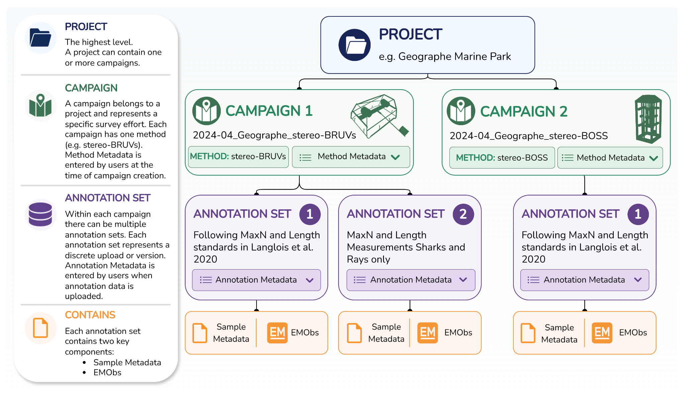
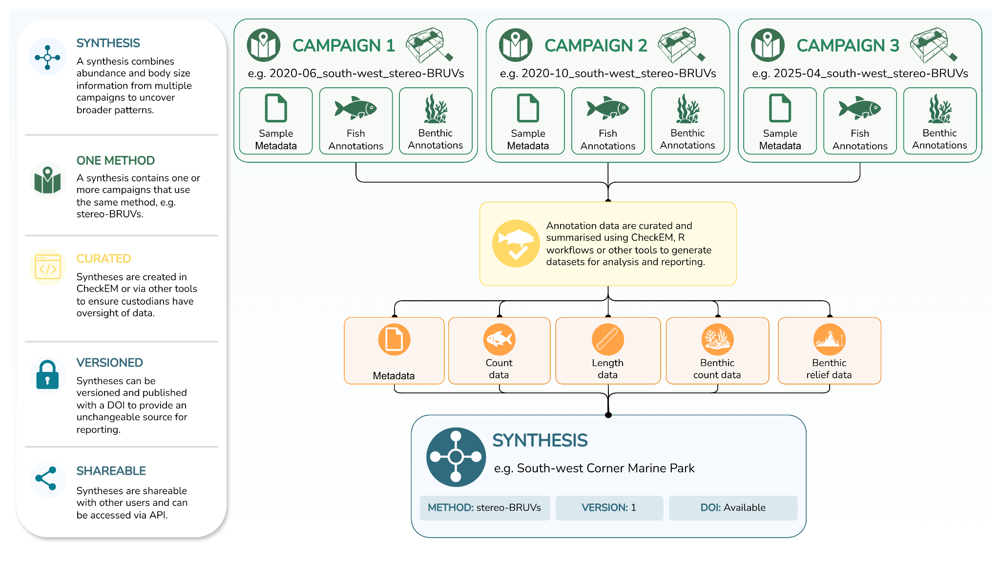

# GlobalArchive User Manual and R Package

Mono and stereo-video imagery annotation provides useful information
for the discovery, description and management of the marine environment 
(Harvey et al. 2021), not only for fish and shark assemblages, but also for 
characterising benthic biota (Langlois et al. 2021; Williams et al. 2020).

Such imagery can be sourced from a variety of platforms, including:

- stereo-BRUVs: baited remote underwater stereo-video
- stereo-DOVs: diver-operated stereo-video

The standardisation, archiving and sharing of annotation data through
[Syntheses](https://globalarchivemanual.github.io/GlobalArchive/articles/user-guide/glossary.html#synthesissyntheses) 
can contribute to understanding large spatial and temporal scale patterns in 
marine biodiversity to inform management.

GlobalArchive is a collaborative archive for stereo-video annotations of fish 
and benthic assemblages, designed to support data standardisation, discovery, 
sharing and synthesis of this data. The platform brings together sampling 
information and image annotation outputs (as [<u>Projects</u>](https://globalarchivemanual.github.io/GlobalArchive/articles/user-guide/glossary.html#project) \> 
[<u>Campaigns</u>](https://globalarchivemanual.github.io/GlobalArchive/articles/user-guide/glossary.html#campaign) \> 
[<u>Annotation sets</u>](https://globalarchivemanual.github.io/GlobalArchive/articles/user-guide/glossary.html#annotation-set)) 
and summaries of count and length data for fish and benthic assemblages 
(as [<u>Syntheses</u>](https://globalarchivemanual.github.io/GlobalArchive/articles/user-guide/glossary.html#synthesissyntheses)) 
ready for reporting. It is designed around core principles of secure user 
access, standardised data import, and the capturing of both field sampling and 
image analysis information.

The platform is designed to ensure [<u>FAIR data principles</u>](https://www.go-fair.org/fair-principles/) are complied with, but to also 
enable granular data access so that users can choose the level of open-access 
applied to the sampling, annotation or [<u>Synthesis</u>](https://globalarchivemanual.github.io/GlobalArchive/articles/user-guide/glossary.html#synthesissyntheses) 
data. CARE data principles are achieved by enabling users to control the access 
to their data.

For stereo-video image annotation, data can be directly ingested from common 
software (e.g. SeaGIS EventMeasure) or imported in generic format, after 
Quality Control checks (see [<u>CheckEM</u>](https://globalarchivemanual.github.io/CheckEM/index.html)). 
Schema controlled Annotation data is associated with [<u>Campaigns</u>](https://globalarchivemanual.github.io/GlobalArchive/articles/user-guide/glossary.html#campaign) 
of samples that are organised within [<u>Projects</u>](https://globalarchivemanual.github.io/GlobalArchive/articles/user-guide/glossary.html#project).

Curated summaries of count and length data for fish and benthic assemblages 
made from annotation data on GlobalArchive or other platforms, can be published 
with a DOI and versioned to provide an unchangeable source for environmental 
reporting.

Data can be accessed via a secure API and R package, enabling efficient and 
structured querying of all sampling, annotation, within a Campaign, and 
[<u>Synthesis</u>](https://globalarchivemanual.github.io/GlobalArchive/articles/user-guide/glossary.html#synthesissyntheses) 
data.

## Uploading annotations

## Creating a synthesis

