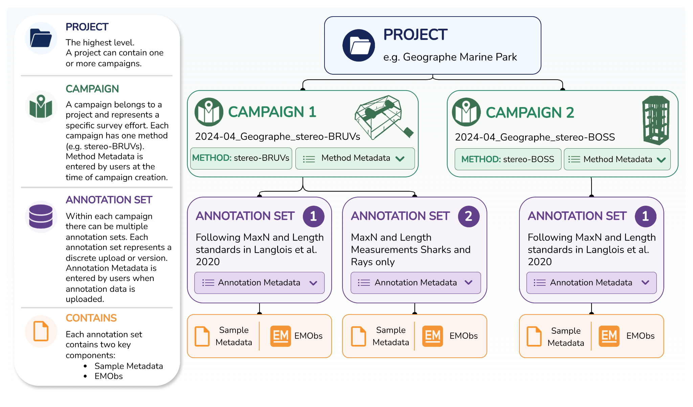

# About

## About GlobalArchive

Mono and stereo-video imagery annotation provides useful information for
the discovery, description and management of the marine environment
(Harvey et al. 2021), not only for fish and shark assemblages, but also
for characterising benthic biota (Langlois et al. 2021; Williams et
al. 2020). Such imagery can be sourced from a variety of platforms
(e.g. stereo-BRUV, Baited Remote Underwater stereo-Video; stereo-DOV,
Diver Operated stereo-Video). The standardisation, archiving and sharing
of this annotation data through [*synthesis*](#synthesis) can contribute
to understanding large spatial and temporal scale patterns in marine
biodiversity to inform management.

GlobalArchive is a collaborative archive for stereo-video annotations of
fish and benthic assemblages, designed to support data standardisation,
discovery, sharing and synthesis of this data. The platform brings
together sampling information and image annotation outputs (as
[*Projects*](#project) \> [*Campaigns*](#campaign) \> [*Annotation
sets*](#id__244z831h9k4k)) and summaries of count and length data for
fish and benthic assemblages (as
[*Syntheses*](http://synthesis/Syntheses)) ready for reporting. It is
designed around core principles of secure user access, standardised data
import, and the capturing of both field sampling and image analysis
information.

The platform is designed to ensure [*FAIR data
principles*](https://www.go-fair.org/fair-principles/) are complied
with, but to also enable granular data access so that users can choose
the level of open-access applied to the sampling, annotation or
[*Synthesis*](http://synthesis/Syntheses) data. CARE data principles are
achieved by enabling users to control the access to their data.

For stereo-video image annotation, data can be directly ingested from
common software (e.g. SeaGIS EventMeasure) or imported in generic
format, after Quality Control checks (see
[*CheckEM*](https://globalarchivemanual.github.io/CheckEM/index.html)).
Schema controlled Annotation data is associated with
[*Campaigns*](#campaign) of samples that are organised within
[*Projects*](#project).

Curated summaries of count and length data for fish and benthic
assemblages made from annotation data on GlobalArchive or other
platforms, can be published with a DOI and versioned to provide an
unchangeable source for environmental reporting.

Data can be accessed via a secure API and R package, enabling efficient
and structured querying of all sampling, annotation, within a Campaign,
and [*Synthesis*](http://synthesis/Syntheses) data.

### Overview - uploading [*Annotation*](#id__244z831h9k4k)s

### Overview - creating a [*Synthesis*](#synthesis)
