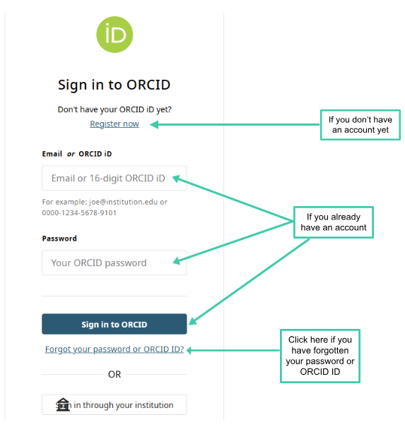
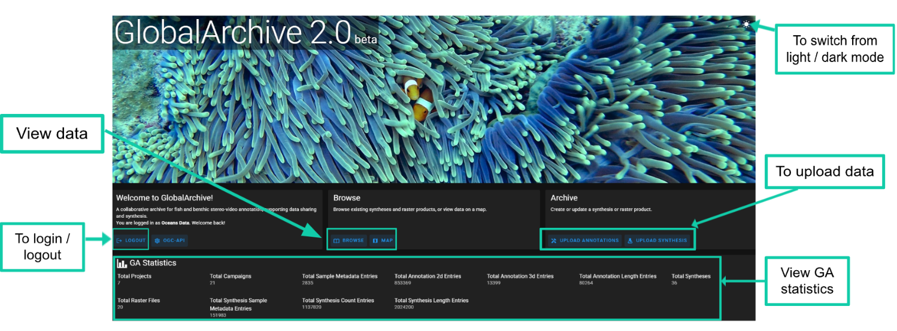

# Create Account

## Create an account

1.  Navigate to [*GlobalArchive.org
    2.0*](https://dev.globalarchive.org/ui/)

2.  Click *LOGIN*

GlobalArchive uses ORCID IDs for user authentication.

- *If you already have an ORCID:*

  - Enter your account details. Click *Sign in to ORCID.*

- *If you don’t have an ORCID:*

  - Select *Register now* and create an ORCID.

- *If you have forgotten your ORCID ID or password*

  - Click ‘*Forgot your password or ORCID ID?*’ and follow the
    instructions on the page.

### 

### Navigating the GlobalArchive landing page

- To view data

  - Click *BROWSE* to view [*Syntheses*](#synthesis)

    - Use the side menu to view [*Projects*](#project) and
      [*Campaigns*](https://docs.google.com/document/d/1yU-zrEIwBN1B-w-rnwxRlZ8rEioJ37bxk7l5LkXhgoM/edit?userstoinvite=annika.leunig%40marineecology.io&sharingaction=manageaccess&role=reader&tab=t.0#heading=h.watfbpgrrufl)

  - Click *MAP* to discover data spatially.

- Click *UPLOAD ANNOTATIONS* to upload Annotations (within
  [*Campaigns*](https://docs.google.com/document/d/1yU-zrEIwBN1B-w-rnwxRlZ8rEioJ37bxk7l5LkXhgoM/edit?userstoinvite=annika.leunig%40marineecology.io&sharingaction=manageaccess&role=reader&tab=t.0#heading=h.watfbpgrrufl)
  within [*Projects*](#projects))

- Click *UPLOAD [*SYNTHESIS*](#synthesis)* to upload
  [*Syntheses*](http://synthesis/Syntheses).

## 
