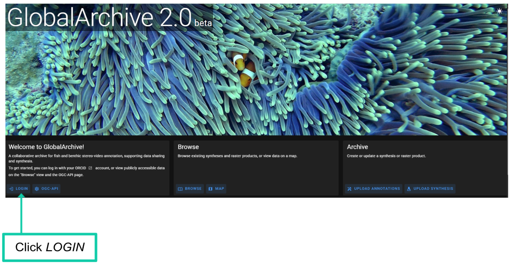
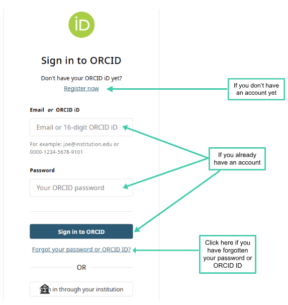

# Create Account

## Create an account

1.  Navigate to [*GlobalArchive.org
    2.0*](https://dev.globalarchive.org/ui/)

2.  Click *LOGIN*

GlobalArchive uses ORCID IDs for user authentication.

- *If you already have an ORCID:*
  - Enter your account details. Click *Sign in to ORCID.*
- *If you don’t have an ORCID:*
  - Select *Register now* and create an ORCID.
- *If you have forgotten your ORCID ID or password*
  - Click ‘*Forgot your password or ORCID ID?*’ and follow the
    instructions on the page.

### 

### Navigating the GlobalArchive landing page

- To view data

  - Click *BROWSE* to view
    [*Syntheses*](http://127.0.0.1:61388/articles/user-guide/glossary.html#synthesissyntheses)
    - Use the side menu to view
      [*Projects*](http://127.0.0.1:61388/articles/user-guide/glossary.html#project)
      and
      [*Campaigns*](http://127.0.0.1:61388/articles/user-guide/glossary.html#campaign)
  - Click *MAP* to discover data spatially.

- Click *UPLOAD ANNOTATIONS* to upload Annotations (within
  [*Campaigns*](http://127.0.0.1:61388/articles/user-guide/glossary.html#campaign)
  within
  [*Projects*](http://127.0.0.1:61388/articles/user-guide/glossary.html#project))

- Click *UPLOAD
  [*SYNTHESIS*](http://127.0.0.1:61388/articles/user-guide/glossary.html#synthesissyntheses)*
  to upload
  [*Syntheses*](http://127.0.0.1:61388/articles/user-guide/glossary.html#synthesissyntheses).

## 
