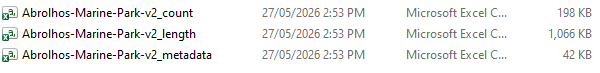

# R Workflows

## Appendix 3 - R Workflows and GitHub template

The files generated in the [*EventMeasure
Exports*](#appendix-2---how-to-download-and-summarise-annotation-data)
section of this manual are the input files required for the
[*Synthesi*](#synthesis)s template, which can be accessed
[*here*](https://github.com/UWA-Marine-Ecology-Group-syntheses/template-synthesis).
Running the [*Synthesis*](#synthesis) script produces the output files
that are ready to be uploaded to the [*Synthesis*](#synthesis) on
GlobalArchive.

- Below is an example of the files that will be generated from this
  script.

- This script can be used the combine the data of multiple
  [*Campaigns*](https://docs.google.com/document/d/1yU-zrEIwBN1B-w-rnwxRlZ8rEioJ37bxk7l5LkXhgoM/edit?userstoinvite=annika.leunig%40marineecology.io&sharingaction=manageaccess&role=reader&tab=t.0#heading=h.watfbpgrrufl)
  into 1 file

> More handy R workflows coming soon…

## 
