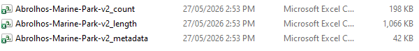

# R Workflows

## Appendix 3 - R Workflows and GitHub template

The files generated in the [*EventMeasure
Exports*](https://globalarchivemanual.github.io/GlobalArchive/articles/user-guide/glossary.html#appendix-2---how-to-download-and-summarise-annotation-data)
section of this manual are the input files required for the
[*Synthesis*](https://globalarchivemanual.github.io/GlobalArchive/articles/user-guide/glossary.html#synthesissyntheses)
template, which can be accessed
[*here*](https://github.com/UWA-Marine-Ecology-Group-syntheses/template-synthesis).
Running the
[*Synthesis*](https://globalarchivemanual.github.io/GlobalArchive/articles/user-guide/glossary.html#synthesissyntheses)
script produces the output files that are ready to be uploaded to the
[*Synthesis*](https://globalarchivemanual.github.io/GlobalArchive/articles/user-guide/glossary.html#synthesissyntheses)
on GlobalArchive.

- Below is an example of the files that will be generated from this
  script.

- This script can be used the combine the data of multiple
  [*Campaigns*](https://globalarchivemanual.github.io/GlobalArchive/articles/user-guide/glossary.html#campaign)
  into 1 file

More handy R workflows coming soon…

## 
