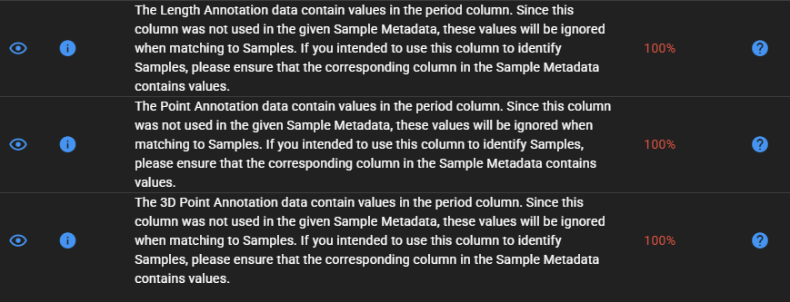

## Appendix 5 - Common errors

Spreadsheet with all possible errors and most common solutions coming soon…..

### Examples of Errors

EXAMPLE 1:

- This error occurs in [<u>Annotation Set</u>](#_244z831h9k4k) Uploads

- Some EMObs use 60-minute periods for video annotation periods, that begins when the video system contacts the ground.

- The three issues below occur in datasets that use this period structure because period information is not included in the metadata. This information is only used to determine when to stop annotating, these issues can be ignored.

- No corrections are required, and the data can be imported as is

EXAMPLE 2:

- This error occurs in [<u>Synthesis</u>](#synthesis) Uploads

- The below warning is occurring due to data from metadata not matching the benthos count data that has been uploaded.

- To fix this, hover over the in the cause column to see what rows are impacted by this error.

- This could be due to individual opcodes not matching between the count data and metadata or due to uploading the wrong file.

- Check the column affected and fix the issue

EXAMPLE 3:

- This error occurs in [<u>Annotation Set</u>](https://docs.google.com/document/d/1yU-zrEIwBN1B-w-rnwxRlZ8rEioJ37bxk7l5LkXhgoM/edit?userstoinvite=annika.leunig%40marineecology.io&sharingaction=manageaccess&role=reader&tab=t.0#heading=h.244z831h9k4k) and [<u>Synthesis</u>](#synthesis) Uploads

- The below warning occurs due to [<u>samples</u>](#sample) sharing identical coordinates.

- Click the to view the affected metadata rows. In this case the duplicates correspond to repeated cases where the initial deployment was unsuccessful (e.g. landing upside down or being retrieved too early).

- As the first [<u>sample</u>](#sample) has already been recorded as unsuccessful, no action is required.

##  

