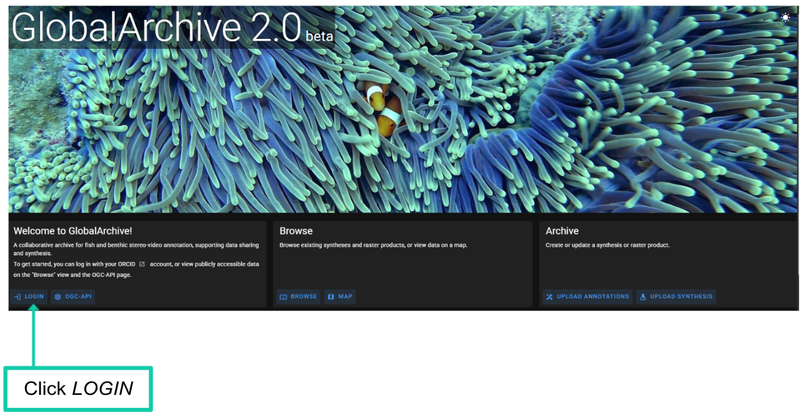

# Create an account

1.  Navigate to [<u>GlobalArchive.org 2.0</u>](https://dev.globalarchive.org/ui/)

2.  Click *LOGIN*

GlobalArchive uses ORCID IDs for user authentication.

- *If you already have an ORCID:*

  - Enter your account details. Click *Sign in to ORCID.*

- *If you don’t have an ORCID:*

  - Select *Register now* and create an ORCID.

- *If you have forgotten your ORCID ID or password*

  - Click ‘*Forgot your password or ORCID ID?*’ and follow the instructions on the page.

##  

## Navigating the GlobalArchive landing page

- To view data

  - Click *BROWSE* to view [<u>Syntheses</u>](#synthesis)

    - Use the side menu to view [<u>Projects</u>](#project) and [<u>Campaigns</u>](https://docs.google.com/document/d/1yU-zrEIwBN1B-w-rnwxRlZ8rEioJ37bxk7l5LkXhgoM/edit?userstoinvite=annika.leunig%40marineecology.io&sharingaction=manageaccess&role=reader&tab=t.0#heading=h.watfbpgrrufl)

  - Click *MAP* to discover data spatially.

- Click *UPLOAD ANNOTATIONS* to upload Annotations (within [<u>Campaigns</u>](https://docs.google.com/document/d/1yU-zrEIwBN1B-w-rnwxRlZ8rEioJ37bxk7l5LkXhgoM/edit?userstoinvite=annika.leunig%40marineecology.io&sharingaction=manageaccess&role=reader&tab=t.0#heading=h.watfbpgrrufl) within [<u>Projects</u>](#projects))

- Click *UPLOAD [<u>SYNTHESIS</u>](#synthesis)* to upload [<u>Syntheses</u>](http://synthesis/Syntheses).

#  

