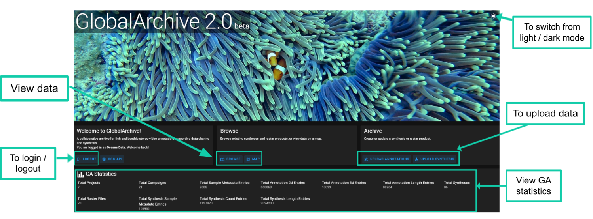

# Create an account

1.  Navigate to [<u>GlobalArchive.org 2.0</u>](https://dev.globalarchive.org/ui/)

2.  Click *LOGIN*

If you work for an organisation in a role - we recommend you consider using a role-based email to register for an ORCID e.g. for the UWA Oceans Institute we have created [https://orcid.org/0009-0007-2402-2916](https://orcid.org/0009-0007-2402-2916) using [oceans.data@uwa.edu.au](oceans.data@uwa.edu.au) to help ensure continuity of data custodianship as people change roles.

GlobalArchive uses ORCID IDs for user authentication.

- *If you already have an ORCID:*
  - Enter your account details. Click *Sign in to ORCID.*

- *If you don’t have an ORCID:*
  - Select *Register now* and create an ORCID.

- *If you have forgotten your ORCID ID or password*
  - Click ‘*Forgot your password or ORCID ID?*’ and follow the instructions on the page.

##  

## Navigating the GlobalArchive landing page

- To view data
  - Click *BROWSE* to view [<u>Syntheses</u>](https://globalarchivemanual.github.io/GlobalArchive/articles/user-guide/glossary.html#synthesissyntheses)
    - Use the side menu to view [<u>Projects</u>](https://globalarchivemanual.github.io/GlobalArchive/articles/user-guide/glossary.html#project) and [<u>Campaigns</u>](https://globalarchivemanual.github.io/GlobalArchive/articles/user-guide/glossary.html#campaign)

  - Click *MAP* to discover data spatially.
  

- Click *UPLOAD ANNOTATIONS* to upload Annotations (within [<u>Campaigns</u>](https://globalarchivemanual.github.io/GlobalArchive/articles/user-guide/glossary.html#campaign) within [<u>Projects</u>](https://globalarchivemanual.github.io/GlobalArchive/articles/user-guide/glossary.html#project))
- Click *UPLOAD [<u>SYNTHESIS</u>](https://globalarchivemanual.github.io/GlobalArchive/articles/user-guide/glossary.html#synthesissyntheses)* to upload [<u>Syntheses</u>](https://globalarchivemanual.github.io/GlobalArchive/articles/user-guide/glossary.html#synthesissyntheses).

#  

