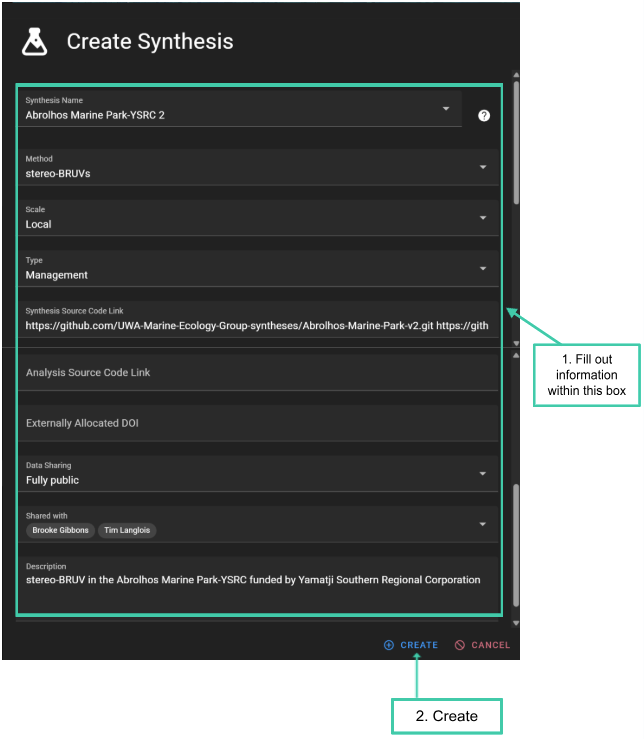
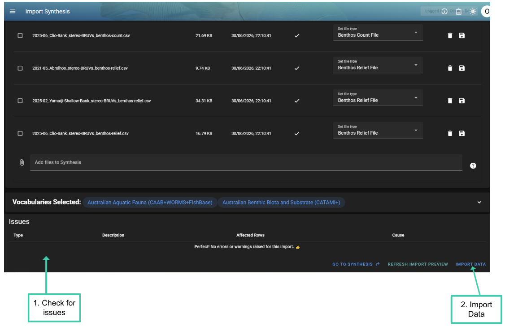

# Creating a Synthesis

## What is a Synthesis?

Curated summaries of count and length data for fish and benthic assemblages, made from annotation data, from GlobalArchive or other platforms, and from multiple times and locations can be brought together in a [<u>Synthesis</u>](http://synthesis/Syntheses).

[<u>Syntheses</u>](http://synthesis/Syntheses) can be versioned and published with a DOI to provide an unchangeable source for reporting.

[<u>Synthesis</u>](http://synthesis/Syntheses) can be created via the CheckEM app or using [<u>example R code</u>](https://github.com/UWA-Marine-Ecology-Group-syntheses/template-synthesis).

## Creating a Synthesis on GlobalArchive

- To create a [<u>Synthesis</u>](http://synthesis/Syntheses)

  - 1\. Click *Import* .

  - 2\. Then *Import [<u>Synthesis</u>](#synthesis)* .

  - 3\. Then click the ⊕ next to *Select a [<u>Synthesis</u>](http://synthesis/Syntheses)*

  - Alternatively, from the landing page click *UPLOAD [<u>SYNTHESIS</u>](#synthesis)* and then click the ⊕ next to *Select a [<u>Synthesis</u>](http://synthesis/Syntheses)*

<!-- -->

- A pop-up will open to Create a [<u>Synthesis</u>](http://synthesis/Syntheses).

- 1\. Complete the relevant fields by typing into the text boxes and selecting options from the drop-down menus.

  - The [<u>Synthesis</u>](#synthesis) name should indicate the location and/or objective of the data collection (e.g. Geographe Marine Park).

  - [<u>Synthesis</u>](#synthesis) names do not need to be unique. GlobalArchive will automatically assign a version number to a duplicate name.

  - All information entered when creating a [<u>Synthesis</u>](http://synthesis/Syntheses) can be edited after the [<u>Synthesis</u>](http://synthesis/Syntheses) has been created.

- 2\. Click *CREATE*

  - Examples of completed [<u>Synthesis</u>](http://synthesis/Syntheses) information are shown below.  
    

## Importing data into a Synthesis

- On the Import [<u>Synthesis</u>](http://synthesis/Syntheses) page, select the [<u>Synthesis</u>](http://synthesis/Syntheses) by typing in the name or scrolling in the dropdown

  - Click the [<u>Synthesis</u>](http://synthesis/Syntheses) you would like to import data into

- 1\. Click *Add files to [<u>Synthesis</u>](#synthesis)*

- 2\. A pop-up will open. Select the files for the [<u>Synthesis</u>](http://synthesis/Syntheses) ([<u>see the Format required for synthesis import</u>](#_e6v9b7rhlziu))

  - Alternatively drag and drop the files into the upload section

- Wait until tick icons appear in the Status column. The files are now ready for importing.

- GlobalArchive will search for the recommended naming patterns and automatically assign the file type e.g. 2021-05_Abrolhos_stereo-BRUVs\_**benthos-count.csv** will be assigned to *Benthos Count File*.

- GlobalArchive accepts other naming conventions, if the files do not have the recommended suffix the file type will need to be set manually. To do this:

  - 1\. Click the *Set file type* dropdown

  - 2\. Select the appropriate file type from the dropdown menu

- The recommended naming conventions are listed in the [<u>format required for import</u>](#_e6v9b7rhlziu) section

To delete multiple files

- 1\. Select the check boxes.

- 2\. At the bottom of the list of files press *Delete selected files.*

- 3\. Confirm deletion.

### Choosing a Vocabulary

- Next select the taxonomic vocabulary used by using the drop down menu

- NOTE at present, the only vocabularies are the *Australian Aquatic Fauna (CAAB+WORMS+FishBase)* for fish and *Australian Benthic Biota and Substrate (CATAMI+)* for Benthic organisms and habitat classification.

### Check for Issues

- After adding files into a [<u>Synthesis</u>](http://synthesis/Syntheses)*,* the Issues section will refresh with any errors

- The *Issues* section lists any problems detected in the uploaded data. Each row shows:

  - the type of issue

  - a description of the issue

  - the percentage of rows affected

<!-- -->

- The *Type* column indicates the severity of the issue:

  - ℹ️Info: General information about the data. These messages do not prevent the file from being imported but may highlight something useful to review.

  - ⚠︎Warning: A potential problem that should be checked before importing. The file can usually still be imported, but some rows or values may need attention.

  - Error: A problem that must be fixed before the file can be imported. Errors usually indicate missing required fields, invalid values, or formatting issues that prevent the import from continuing.

<!-- -->

- A detailed explanation of individual errors/warnings, common causes and trouble shooting tips can be found in Table X. Coming soon…

- 1\. After reviewing the flagged issues, you will need to decide whether the issue represents a genuine problem in the data. If the data needs to be corrected, return to the original files and fix the issue at the source. Once the source files have been corrected, re-upload the files and refresh the import preview.

- 2\. Once you are happy with your uploads click *‘Import Data’.*

#  

