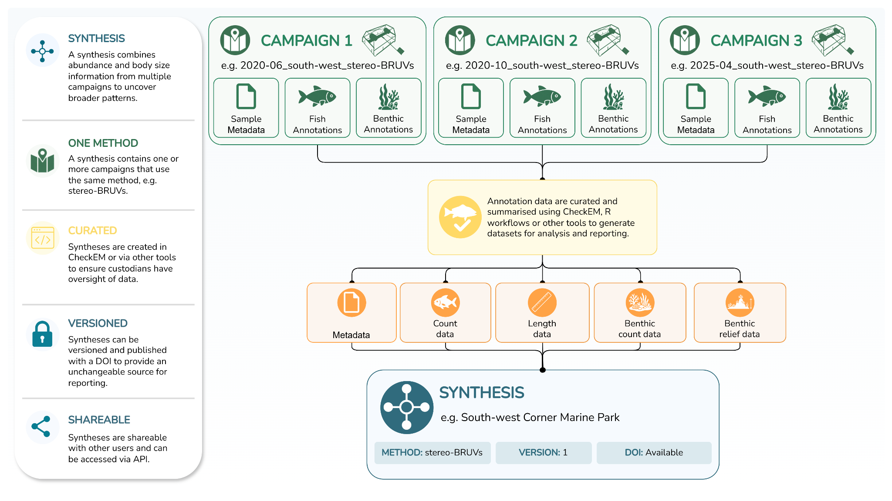

# GlobalArchive User Guide

GlobalArchive supports the standardisation, secure archiving, discovery, sharing and synthesis of marine image-annotation data. Use this guide to create an account, upload annotation data organised into Projects and Campaigns, build curated Syntheses, and prepare data for access through GlobalArchive and its associated R package.

<strong>New to GlobalArchive?</strong> Begin with <a href="getting-started.html">Using this guide</a>, then follow <a href="create-account.html">Create an account</a> before uploading data.

## Choose a workflow

<h3 class="card-title">Upload annotations</h3>

Create a Project, add a Campaign and its method metadata, create an Annotation Set, upload sample metadata and annotation files, and review import issues.

<a class="btn btn-primary" href="upload-annotations.html">Upload annotations</a>

<h3 class="card-title">Create a synthesis</h3>

Combine curated count, length, metadata and benthic data from one or more Campaigns that use the same method, then prepare the Synthesis for sharing, versioning and publication.

<a class="btn btn-primary" href="create-synthesis.html">Create a synthesis</a>

## How GlobalArchive organises data

- A **Project** groups one or more Campaigns with a shared purpose or objective.
- A **Campaign** contains a discrete group of samples collected using one method.
- An **Annotation Set** contains annotation metadata, sample metadata and annotation files for a Campaign.

[Learn more about GlobalArchive and its data structure](about.html)

## From annotations to a synthesis

A Synthesis brings together curated data from multiple Campaigns using the same method. Syntheses can contain sample metadata, fish count and length data, and benthic count, length or relief data.

## Quick links

| I need to... | Go to |
|---|---|
| Understand GlobalArchive terminology | [Definitions and glossary](glossary.html) |
| Check the required CSV columns and file names | [Required import formats](import-formats.html) |
| Diagnose an upload warning or error | [Common errors](common-errors.html) |
| Prepare data using R workflows | [R workflows](r-workflows.html) |
| Find a brief answer or practical tip | [Frequently asked questions](faq.html) |
| Review data handling and privacy information | [Privacy and data sharing](privacy.html) |

## Before uploading data

For the smoothest import:

1. Keep the original annotation files as the authoritative copy of the data.
2. Check that sample identifiers match exactly between sample metadata and annotation or Synthesis files.
3. Use the recommended CSV structures and file-name suffixes.
4. Correct genuine problems in the source files, then upload the corrected files again.
5. Use the Issues and Data View sections to distinguish errors that require correction from warnings that can be accepted after review.

This online guide is based on the <em>GlobalArchive 2.0 How to Guide</em>. Screens and functionality may change as GlobalArchive develops, so update the guide alongside major platform releases.

