# Uploading Annotations

For stereo-video image annotation, data can be directly ingested from common software (e.g. SeaGIS EventMeasure) or imported in generic format after Quality Control checks (see CheckEM). Schema controlled Annotation data is associated with [<u>Campaigns</u>](https://globalarchivemanual.github.io/GlobalArchive/articles/user-guide/glossary.html#campaign) that are organised within [<u>Projects</u>](https://globalarchivemanual.github.io/GlobalArchive/articles/user-guide/glossary.html#project).

## 1. First, create a [<u>Project</u>](https://globalarchivemanual.github.io/GlobalArchive/articles/user-guide/glossary.html#project) and [<u>Campaign</u>](https://globalarchivemanual.github.io/GlobalArchive/articles/user-guide/glossary.html#campaign) to hold Annotations

- Before uploading Annotations we must create a [<u>Campaign</u>](https://globalarchivemanual.github.io/GlobalArchive/articles/user-guide/glossary.html#campaign) within a [<u>Project</u>](https://globalarchivemanual.github.io/GlobalArchive/articles/user-guide/glossary.html#project)

  - 1\. From the landing page click *UPLOAD ANNOTATIONS*

  - 2\. Then ⊕ next to *[<u>Annotation Set</u>](https://globalarchivemanual.github.io/GlobalArchive/articles/user-guide/glossary.html#annotation-set).*

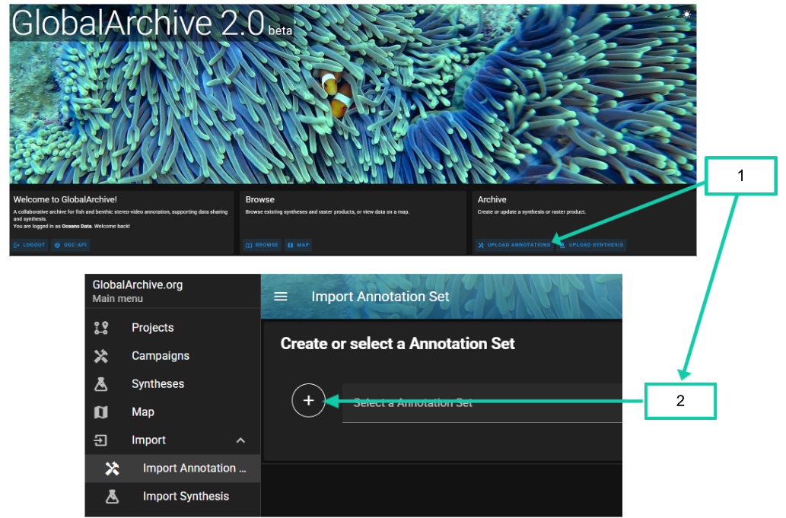

- A pop-up will open to create an *[<u>Annotation Set.</u>](https://globalarchivemanual.github.io/GlobalArchive/articles/user-guide/glossary.html#annotation-set)*

  - 3\. Click the ⊕

> 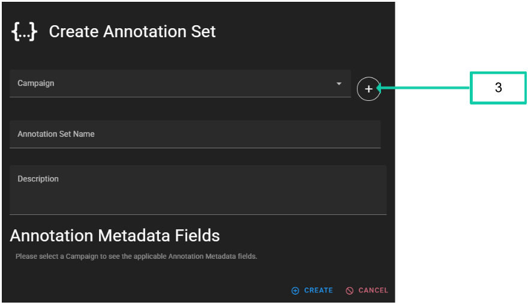

- A pop-up will open to *Create [<u>Campaign</u>](https://globalarchivemanual.github.io/GlobalArchive/articles/user-guide/glossary.html#campaign)*

  - 4\. Click the ⊕ to *Create [<u>Project</u>](https://globalarchivemanual.github.io/GlobalArchive/articles/user-guide/glossary.html#project)*

## 2. Create a [<u>Project</u>](https://globalarchivemanual.github.io/GlobalArchive/articles/user-guide/glossary.html#project)

- 1\. Fill out all the information fields - see Definitions

  - The [<u>Project</u>](https://globalarchivemanual.github.io/GlobalArchive/articles/user-guide/glossary.html#project) name should indicate the location and/or objective of the data collection (e.g. Geographe Marine Park)

  - [<u>Project</u>](https://globalarchivemanual.github.io/GlobalArchive/articles/user-guide/glossary.html#project) names must be unique

   -  **WARNING:** The [<u>Project</u>](https://globalarchivemanual.github.io/GlobalArchive/articles/user-guide/glossary.html#project) name cannot be changed after creation, so ensure it is spelt correctly. Other fields can be edited later.

<!-- -->

- 2\. Click *CREATE*.

## Create a [<u>Campaign</u>](https://globalarchivemanual.github.io/GlobalArchive/articles/user-guide/glossary.html#campaign)

- 1\. Fill out all the information fields - see Definitions

  - If the [<u>Project</u>](https://globalarchivemanual.github.io/GlobalArchive/articles/user-guide/glossary.html#project) was just created, the [<u>Project</u>](https://globalarchivemanual.github.io/GlobalArchive/articles/user-guide/glossary.html#project) will automatically be selected

  - The *Campaign Name* will form the middle of the generated [*<u>CampaignID</u>*](https://globalarchivemanual.github.io/GlobalArchive/articles/user-guide/glossary.html#campaignid)

  - e.g. If the *Campaign Name* is “Abrolhos”, and the earliest stereo-BRUV [<u>sample</u>](https://globalarchivemanual.github.io/GlobalArchive/articles/user-guide/glossary.html#sample) was in May 2021, the [*<u>CampaignID</u>*](https://globalarchivemanual.github.io/GlobalArchive/articles/user-guide/glossary.html#campaignid) will be: 
  - 2021-05_Abrolhos_stereo-BRUVs

- 2\. Click *CREATE.*

NOTE

- Multiple [<u>Campaigns</u>](https://globalarchivemanual.github.io/GlobalArchive/articles/user-guide/glossary.html#campaign) within a [<u>Project</u>](https://globalarchivemanual.github.io/GlobalArchive/articles/user-guide/glossary.html#project) can have the same Campaign Name, provided they differ in [<u>method</u>](https://globalarchivemanual.github.io/GlobalArchive/articles/user-guide/glossary.html#method) and/or the date of the earliest [<u>sample</u>](https://globalarchivemanual.github.io/GlobalArchive/articles/user-guide/glossary.html#sample)

- For example, both of the following [<u>CampaignIDs</u>](https://globalarchivemanual.github.io/GlobalArchive/articles/user-guide/glossary.html#campaignid) can exist within a [<u>Project</u>](https://globalarchivemanual.github.io/GlobalArchive/articles/user-guide/glossary.html#project)

  - 2021-05_Abrolhos_stereo-BRUVs
  
  - 2022-12_Abrolhos_stereo-BRUVs

**WARNING**

- Once the [<u>Campaign</u>](https://globalarchivemanual.github.io/GlobalArchive/articles/user-guide/glossary.html#campaign) has been created, the following fields cannot be edited

    - [<u>Project</u>](https://globalarchivemanual.github.io/GlobalArchive/articles/user-guide/glossary.html#project)
    - Campaign name
    - [<u>Method</u>](https://globalarchivemanual.github.io/GlobalArchive/articles/user-guide/glossary.html#method)
- Please take care when entering these in, and double check before clicking *CREATE*
- If you do need to change the [Project](https://globalarchivemanual.github.io/GlobalArchive/articles/user-guide/glossary.html#project), Campaign Name or [Method](https://globalarchivemanual.github.io/GlobalArchive/articles/user-guide/glossary.html#method), you will need to delete the [Campaign](https://globalarchivemanual.github.io/GlobalArchive/articles/user-guide/glossary.html#campaign) and start again
- All other fields can be edited after the [Campaign](https://globalarchivemanual.github.io/GlobalArchive/articles/user-guide/glossary.html#campaign) is created

### Campaign Method Metadata

GlobalArchive collects additional metadata about the sampling method (e.g. type of bait used, duration of deployment, camera types). This information can be useful to standardise methods or as covariates for further analysis. Once a [<u>Method</u>](https://globalarchivemanual.github.io/GlobalArchive/articles/user-guide/glossary.html#method) is selected the Method Metadata Fields and options will populate.

Below is an example of complete Method Metadata for a stereo-BRUVs [<u>Campaign</u>](https://globalarchivemanual.github.io/GlobalArchive/articles/user-guide/glossary.html#campaign).

- A [<u>Campaign</u>](https://globalarchivemanual.github.io/GlobalArchive/articles/user-guide/glossary.html#campaign) cannot be created if fields are left blank

- The predefined fields and values for method metadata can be viewed [<u>here</u>](https://docs.google.com/spreadsheets/d/1hPK8VFqNDw0bgT92T14BBHAqX6aykmGpcpDFiHo8LcU/edit?gid=1017781667#gid=1017781667). If you would like to add any further values, please contact the [<u>administrator</u>](mailto:tim.langlois@uwa.edu.au).

> 

- If the information for a method metadata field was not recorded or unavailable, click the ‘x’ next to that field (see image below)

> 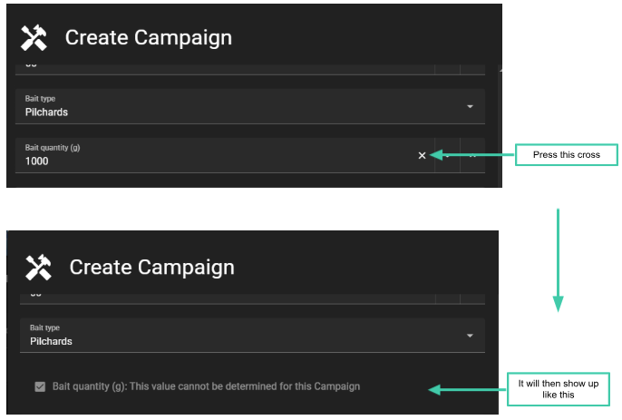

###  

### Copying Method Metadata from existing Campaigns

1.  If you have the same Method Metadata across multiple [<u>Campaigns</u>](https://globalarchivemanual.github.io/GlobalArchive/articles/user-guide/glossary.html#campaign), GlobalArchive allows you to copy Method Metadata from a previous [<u>Campaign</u>](https://globalarchivemanual.github.io/GlobalArchive/articles/user-guide/glossary.html#campaign) where you are the [<u>Custodian</u>](https://globalarchivemanual.github.io/GlobalArchive/articles/user-guide/glossary.html#custodian).

2.  Select [<u>Campaign</u>](https://globalarchivemanual.github.io/GlobalArchive/articles/user-guide/glossary.html#campaign) to copy from.

3.  Click *APPLY*

4.  Then *CREATE*.

**NOTE**

You can edit the Method Metadata fields later, which is useful when most but not all metadata is the same.

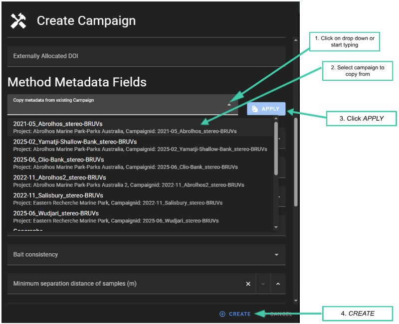

**NOTE**

- [Campaigns](https://globalarchivemanual.github.io/GlobalArchive/articles/user-guide/glossary.html#campaign) won't be listed on the [Campaign](https://globalarchivemanual.github.io/GlobalArchive/articles/user-guide/glossary.html#campaign) screen until annotation data has been imported into the [Annotation Set](https://globalarchivemanual.github.io/GlobalArchive/articles/user-guide/glossary.html#annotation-set).
- This means that if you need to delete a [Campaign](https://globalarchivemanual.github.io/GlobalArchive/articles/user-guide/glossary.html#campaign) you will need to import data before you can delete it.

##  

## Create Annotation Set

- Once the [<u>Campaign</u>](https://globalarchivemanual.github.io/GlobalArchive/articles/user-guide/glossary.html#campaign) has been created upload an [<u>Annotation Set</u>](https://globalarchivemanual.github.io/GlobalArchive/articles/user-guide/glossary.html#annotation-set)

  - 1\. If the [<u>Campaign</u>](https://globalarchivemanual.github.io/GlobalArchive/articles/user-guide/glossary.html#campaign) has just been created the [<u>Campaign</u>](https://globalarchivemanual.github.io/GlobalArchive/articles/user-guide/glossary.html#campaign) will be automatically selected

- [<u>Annotation Set</u>](https://globalarchivemanual.github.io/GlobalArchive/articles/user-guide/glossary.html#annotation-set) names must be unique within a [<u>Campaign</u>](https://globalarchivemanual.github.io/GlobalArchive/articles/user-guide/glossary.html#campaign) and should be a description on how you annotated the imagery. Example [<u>Annotation Set</u>](https://globalarchivemanual.github.io/GlobalArchive/articles/user-guide/glossary.html#annotation-set) names could be ‘Langlois 2020’ if the methods were the same as that in the [<u>BRUV field manual</u>](https://docs.google.com/document/u/0/d/1RMtMtrutk_8p1gXJlq6C-RZvXYQqfGYJIN3stm7JBGQ/edit), or ‘Shark and Rays’ if you only annotated sharks and rays.

- 2\. Fill out the fields.

- 3\. Click *CREATE.*

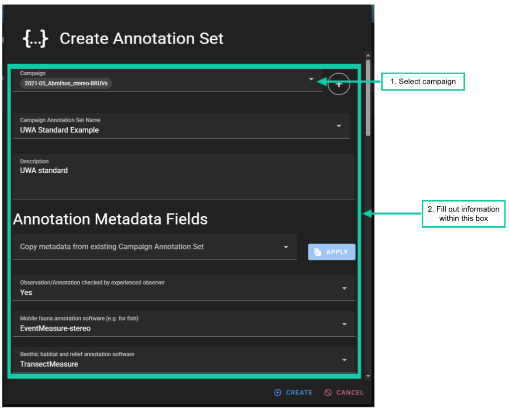

- [<u>Annotation Metadata</u>](https://globalarchivemanual.github.io/GlobalArchive/articles/user-guide/glossary.html#annotation-metadata) fields can be copied from existing [<u>Annotation Sets</u>](https://globalarchivemanual.github.io/GlobalArchive/articles/user-guide/glossary.html#annotation-set) by following the same steps as [<u>copying method metadata fields</u>](#copying-method-metadata-from-existing-campaigns).

- The predefined fields and values for [<u>Annotation Metadata</u>](https://globalarchivemanual.github.io/GlobalArchive/articles/user-guide/glossary.html#annotation-metadata) fields can be viewed [<u>here.</u>](https://docs.google.com/spreadsheets/d/1hPK8VFqNDw0bgT92T14BBHAqX6aykmGpcpDFiHo8LcU/edit?gid=1448516600#gid=1448516600) If you would like to add any further values, please contact the [<u>administrator</u>](mailto:tim.langlois@uwa.edu.au).

> 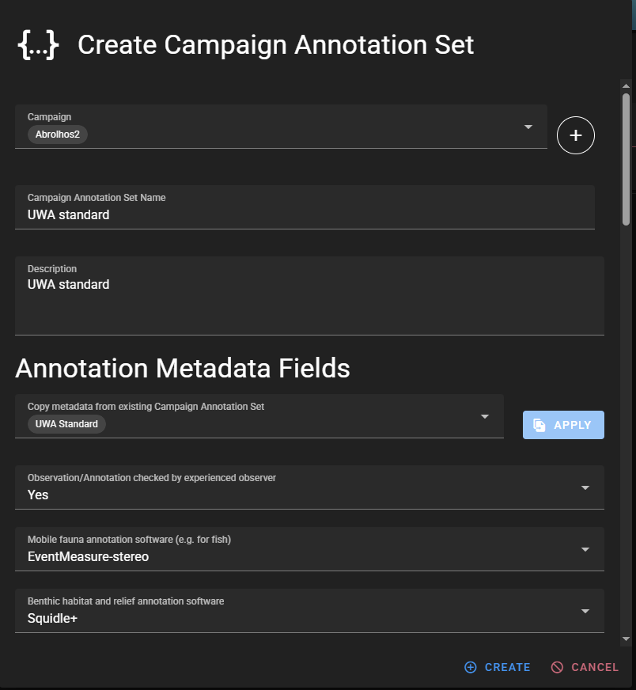
>

**NOTE**

- If you haven't just created the [Campaign](https://globalarchivemanual.github.io/GlobalArchive/articles/user-guide/glossary.html#campaign)
    1. From the landing page click UPLOAD ANNOTATIONS
    2. Click the ⊕ next to Select an [Annotation Set](https://globalarchivemanual.github.io/GlobalArchive/articles/user-guide/glossary.html#annotation-set)
    3. Use the drop down box or type the Campaign name in
    4. Select the [Campaign](https://globalarchivemanual.github.io/GlobalArchive/articles/user-guide/glossary.html#campaign) the [Annotation Set](https://globalarchivemanual.github.io/GlobalArchive/articles/user-guide/glossary.html#annotation-set) will belong in

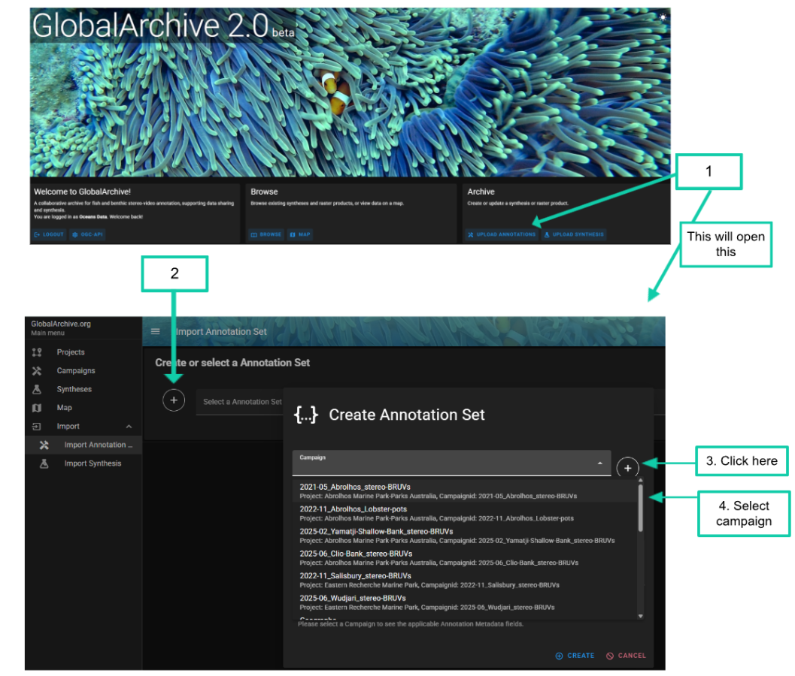

## Importing Annotations

- 1\. If the [<u>Annotation Set</u>](https://globalarchivemanual.github.io/GlobalArchive/articles/user-guide/glossary.html#annotation-set) has just been created, it will automatically be selected and is ready to start importing data

- If the [<u>Annotation Set</u>](https://globalarchivemanual.github.io/GlobalArchive/articles/user-guide/glossary.html#annotation-set) hasn’t just been created

  - 1\. On the landing page click *UPLOAD ANNOTATION*

  - 2\. In the ‘*Select a Annotation Set*’ box type in the Annotation set name or select it from the drop down menu

To import Annotations

- 1\. Click *‘Add files to Annotation Set’*

- 2\. Select the metadata (see [<u>example metadata format</u>](https://globalarchivemanual.github.io/GlobalArchive/articles/user-guide/import-formats.html) and all EMObs for the [<u>Annotation Set</u>](https://globalarchivemanual.github.io/GlobalArchive/articles/user-guide/glossary.html#annotation-set) from your local computer

- Alternatively drag and drop the metadata and EMObs into the *‘Add files to Annotation Set’* section

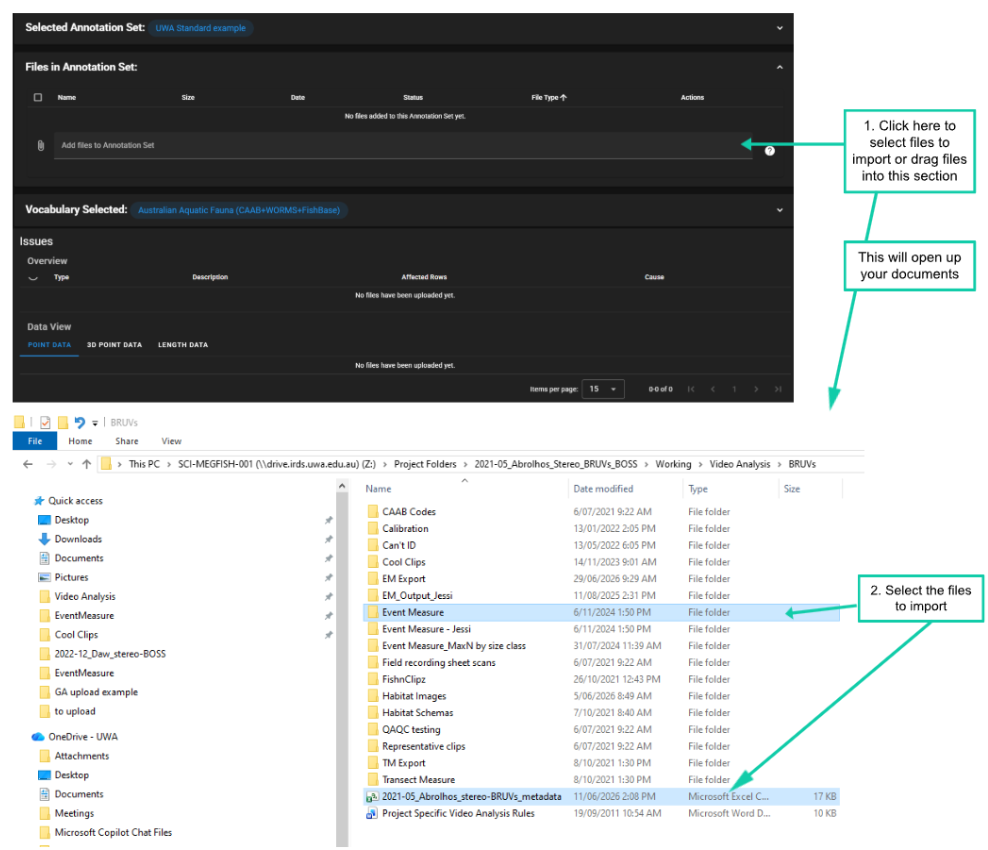

- 1\. Click the drop down arrow next to the imports to check the status

- 2\. If there is a tick in the *Status* column, the files are ready

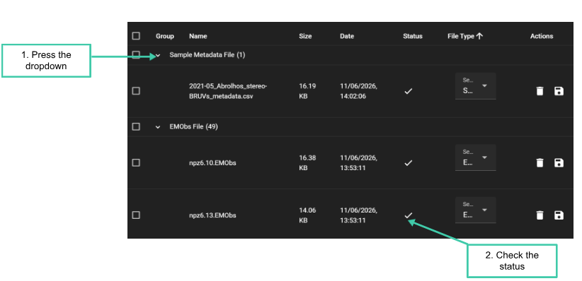

- Next

  - 3 & 4. Select the taxonomic vocabulary used

  - NOTE currently the only option is the *Australian Aquatic Fauna (CAAB+WORMS+FishBase)* and *AphiaID Taxonomy*.

  - This will add the vocabulary and refresh the screen, showing any errors with the uploads

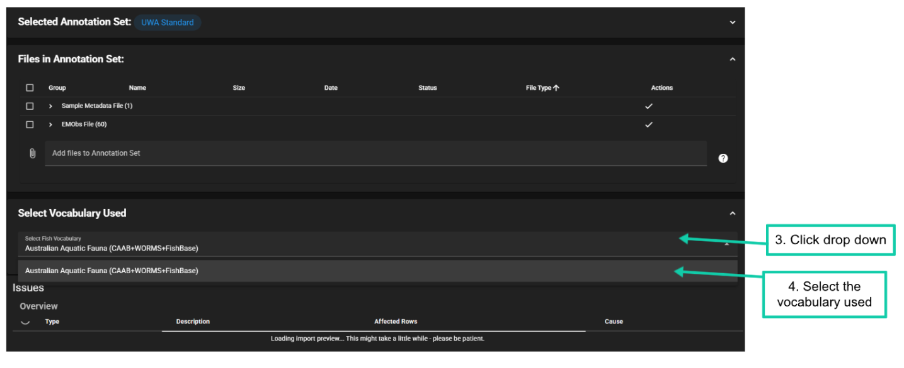

### Check for Issues

- Scroll to the *Issues* section.

- The *Issues* section lists any problems detected in the uploaded data. Each row shows:

  - the type of issue

  - a description of the issue

  - the percentage of rows affected

<!-- -->

- The *Type* column indicates the severity of the issue:
  - <svg xmlns="http://www.w3.org/2000/svg" viewBox="0 0 24 24" width="20" height="20"><title>information</title><path fill="#1E88E5" d="M12,2A10,10 0 0,0 2,12A10,10 0 0,0 12,22A10,10 0 0,0 22,12A10,10 0 0,0 12,2Z" /><path fill="black" d="M13,9H11V7H13M13,17H11V11H13" /></svg> Info: General information about the data. These messages do not prevent the file from being imported but may highlight something useful to review.
  - <svg xmlns="http://www.w3.org/2000/svg" viewBox="0 0 24 24" width="20" height="20"><title>alert</title><path fill="#E87722" d="M1 21H23L12 2L1 21Z" /><path fill="black" d="M13 14H11V9H13M13 18H11V16H13" /></svg> Warning: A potential problem that should be checked before importing. The file can usually still be imported, but some rows or values may need attention.
  - <svg xmlns="http://www.w3.org/2000/svg" viewBox="0 0 24 24" width="20" height="20"><title>alert-circle</title><path fill="#E53935" d="M12,2A10,10 0 0,0 2,12A10,10 0 0,0 12,22A10,10 0 0,0 22,12A10,10 0 0,0 12,2Z" /><path fill="black" d="M13,13H11V7H13M13,17H11V15H13" /></svg> Error: A problem that must be fixed before the file can be imported. Errors usually indicate missing required fields, invalid values, or formatting issues that prevent the import from continuing.
<!-- -->

- A detailed explanation of individual errors/warnings, common causes and trouble shooting tips can be found in Table X. Coming soon…

- Use the `<svg xmlns="http://www.w3.org/2000/svg" viewBox="0 0 24 24" width="20" height="20" fill="#1E88E5"><title>eye-outline</title><path d="M12,9A3,3 0 0,1 15,12A3,3 0 0,1 12,15A3,3 0 0,1 9,12A3,3 0 0,1 12,9M12,4.5C17,4.5 21.27,7.61 23,12C21.27,16.39 17,19.5 12,19.5C7,19.5 2.73,16.39 1,12C2.73,7.61 7,4.5 12,4.5M3.18,12C4.83,15.36 8.24,17.5 12,17.5C15.76,17.5 19.17,15.36 20.82,12C19.17,8.64 15.76,6.5 12,6.5C8.24,6.5 4.83,8.64 3.18,12Z" /></svg>`{=html} icon to filter the data view so that only the rows causing the selected issue are displayed. This is useful when you want to inspect the affected records directly, check what needs to be corrected, or focus on one issue at a time without viewing all the problematic rows at once.
- In the *Cause* column, hover your cursor over the `<svg xmlns="http://www.w3.org/2000/svg" viewBox="0 0 24 24" width="20" height="20"><title>help-circle</title><path fill="#1E88E5" d="M12,2A10,10 0 0,0 2,12A10,10 0 0,0 12,22A10,10 0 0,0 22,12C22,6.47 17.5,2 12,2Z" /><path fill="black" d="M15.07,11.25L14.17,12.17C13.45,12.89 13,13.5 13,15H11V14.5C11,13.39 11.45,12.39 12.17,11.67L13.41,10.41C13.78,10.05 14,9.55 14,9C14,7.89 13.1,7 12,7A2,2 0 0,0 10,9H8A4,4 0 0,1 12,5A4,4 0 0,1 16,9C16,9.88 15.64,10.67 15.07,11.25M13,19H11V17H13" /></svg>`{=html} symbol to view more details about the issue, including the affected file, columns or rows, and the percentage of rows affected.

- Use the *Data View* section to view the rows in the uploaded data that are causing the flagged issues.

- The **Data View** section contains six tabs:
  - *Sample Metadata*,

  - *Point Data*,

  - *3D Point Data*,

  - *Length Data*,
  
  - *Summary Count*,
  
  - *Summary Length*
  

- Each tab displays the problematic rows from the uploaded files. If there are no problematic rows for a particular data type, the table will be blank.

- Cells containing an issue are highlighted in **orange**. Hover over a highlighted cell to view a description of the issue.

- At the bottom of the *Data View table*, you can change how many rows are displayed per page.

- Use the page arrows to move between pages of flagged rows.

- Use the horizontal scroll bar to scroll across the table and view additional columns. This is useful for reviewing more information about the errors, including details in the EMObs columns.

- After reviewing the flagged rows, you will need to decide whether the issue represents a genuine problem in the data. If the data needs to be corrected, return to the original annotation files in EventMeasure and fix the issue at the source. Once the source files have been corrected, re-upload the files and check the issues panel again.

- Once you are happy with your uploads click *‘Import Data’.*

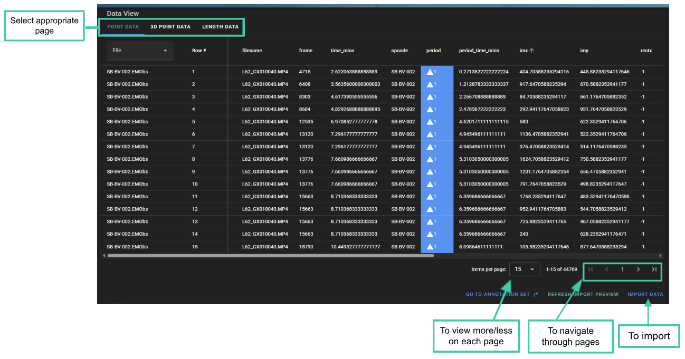

**EXAMPLE**:

- The screengrab below shows the *Issues Overview section* filtered to one issue ‘‘The 3D Point Annotation data contain rows with blank or missing values in the ‘period’ column’.

- The 3D Point Data tab lists the opcodes affected by the selected issue.

- The cells containing the issue are highlighted in orange.

- The affected cells are in the period column, there are no values in the period column because the annotations are outside of a period definition.

- The user will review all the 3D measurements that are outside of the period, and check the values in the other columns. By looking at the comment column, we can see that a comment exists for each cell ‘sync point’.

- 3D points without a period are commonly used to set a ‘sync point’ in EventMeasure, as long as there are no values in Family, Genus, Species or Number.

- Therefore, in this example the user will ignore this warning and continue with the import after checking that the 3D measurements flagged are all sync points.

- If there was a 3D point outside of the period with information in the Family, Genus and Species columns.

- The user would open the EMObs on EventMeasure and check it.

  - If it needed to be changed, the user would fix it and save the EMObs, delete the existing EMObs file on GlobalArchive and upload the fixed one.

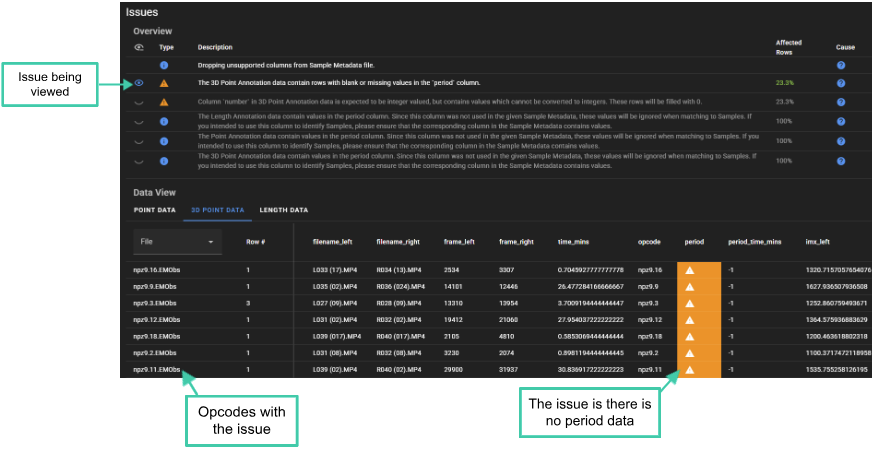

**NOTE**

- GlobalArchive provides a complete archive of all the information held with an EventMeasure annotation file (.EMObs). However, GlobalArchive is NOT a video repository and therefore your local annotation files remain the "true" copy of the data and any corrections must be made in the annotation file and then re-imported to GlobalArchive.
- Please look after your annotation files.
- If you have used the [EventMeasure](http://www.seagis.com.au/event.html) software to annotate but have made "corrections" on exported data (e.g. in Excel), this "corrected" data is now the "true" copy of the data and you should import your data as Generic Annotation files (e.g. [count](https://globalarchivemanual.github.io/GlobalArchive/articles/user-guide/import-formats.html#count) and [length](https://globalarchivemanual.github.io/GlobalArchive/articles/user-guide/import-formats.html#length) data). However we strongly advise you to make these corrections to the EventMeasure annotation file (.EMObs).

- Import of Generic Annotations is coming soon…

# 

#  

